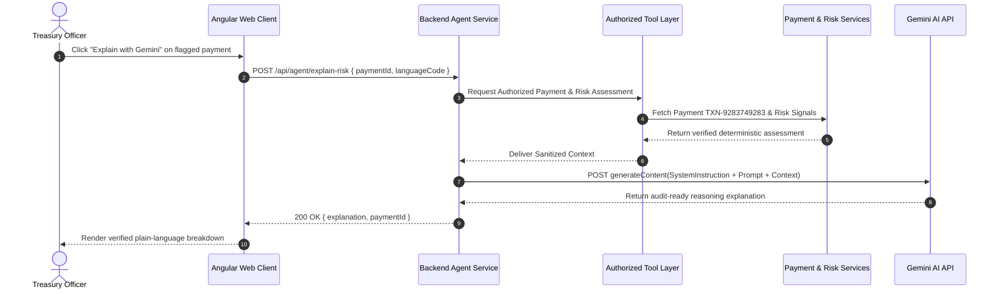
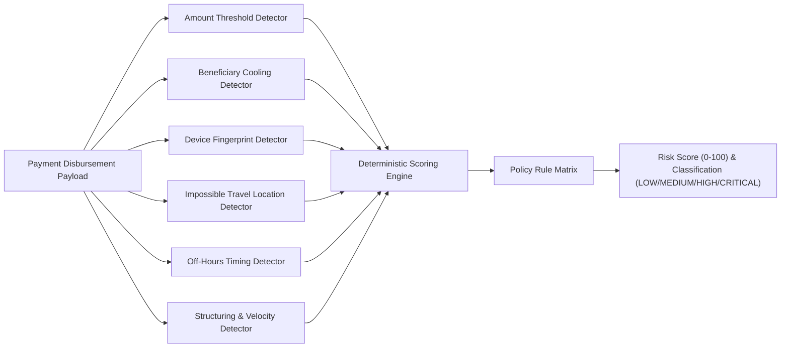
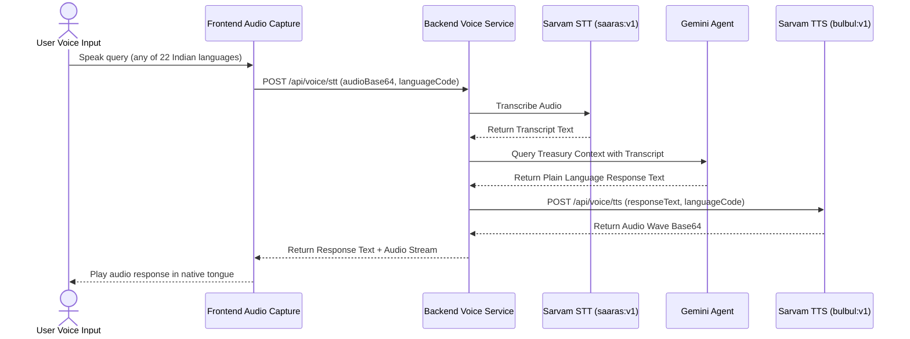

# DeepAudit AI — Architectural Specification

DeepAudit AI is an enterprise platform designed for AI-assisted corporate payment authorization, deterministic fraud prevention, multi-signal risk scoring, and multilingual voice interaction.

---

## 1. System Topology

```mermaid
graph TD
    Client[Angular 19 Frontend Web App] -->|HTTPS REST| APIGateway[Node.js API Service :3000]
    
    subgraph "Core Monorepo Packages"
        APIGateway --> SharedTypes[@deepaudit/shared-types]
        APIGateway --> RiskEnginePkg[@deepaudit/risk-engine]
        APIGateway --> AIAgentPkg[@deepaudit/ai-agent]
        APIGateway --> VoicePkg[@deepaudit/voice]
        APIGateway --> LanguagePkg[@deepaudit/language]
    end

    subgraph "External Rails & AI Engines"
        AIAgentPkg -->|Structured Context Only| GeminiAPI[Google Gemini 2.5 Flash]
        VoicePkg -->|Encrypted Audio| SarvamAPI[Sarvam AI STT & TTS]
        APIGateway -->|IMPS / NEFT Rails| RazorpayPG[Razorpay Enterprise Gateway]
    end

    subgraph "Persistence"
        APIGateway --> Postgres[(PostgreSQL DB + Audit Ledger)]
    end
```

---

## 2. AI Architecture (Controlled Tool Layer)

Gemini API is strictly isolated on the backend. Gemini **never** accesses the database directly and **never** calculates or overrides risk scores.



---

## 3. Deterministic Risk Engine Flow

Risk scores (0–100) are computed mathematically across 6 independent signal categories:



---

## 4. Voice Processing Flow (Sarvam AI)

Voice interactions route through backend provider abstractions to avoid client-side API key leakage:



---

## 5. Dual-Control Authorization & Immutability

1. **Maker Submission**: Treasury Maker creates payment -> Deterministic risk evaluation triggers.
2. **Step-Up Verification**: If risk score >= 60 (HIGH/CRITICAL), platform biometric passkey (WebAuthn) is required.
3. **Checker Approval**: Authorized Checker reviews Gemini reasoning and approves or declines.
4. **Append-Only Audit**: Every single step is hashed using SHA-256 with the previous event's hash, forming an immutable chain.
